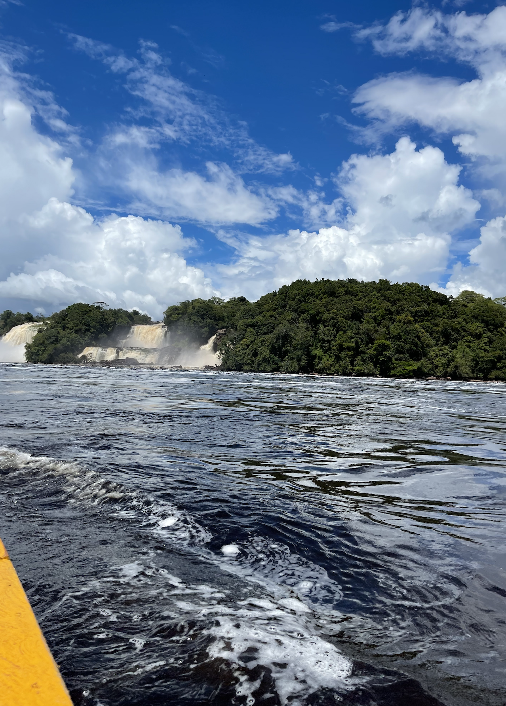
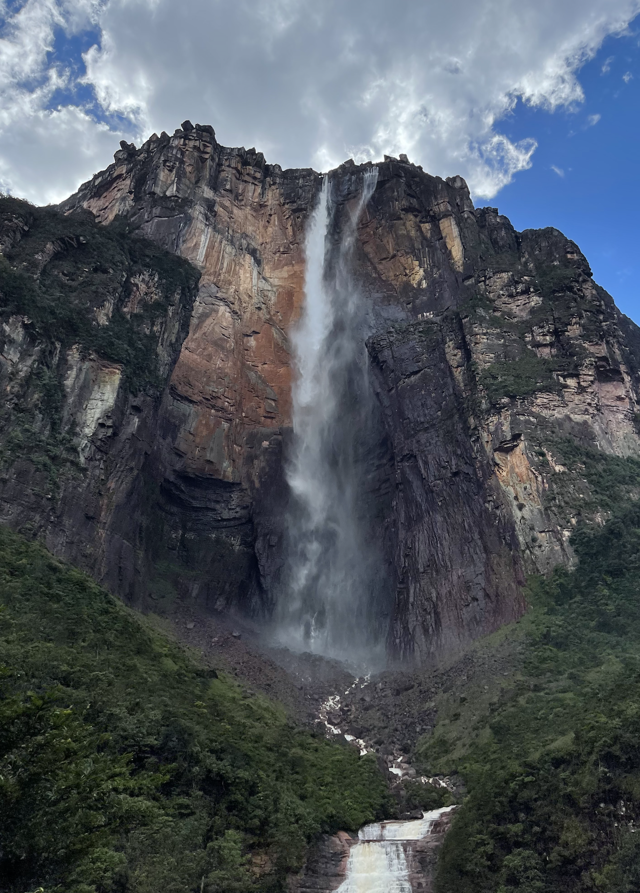
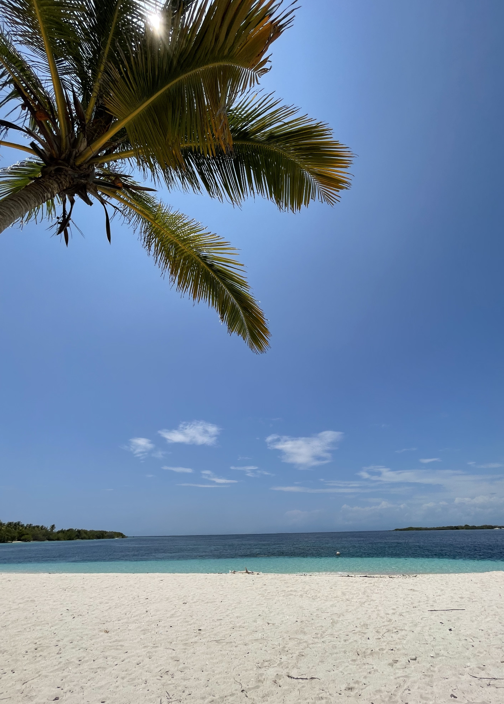

# Hello! My name is **José Santana Sosa**
## I'm happy you made it to my *User Page*


> This is me

## Table of contents
- [Basic information](https://jvsantanasosa.github.io/CSE110/#basic-information)
- [Fun Fact](https://jvsantanasosa.github.io/CSE110/#fun-fact)
- [Stay connected!](https://jvsantanasosa.github.io/CSE110/#stay-connected)

### Basic information
***University:*** University of California San Diego\
***Major:*** Computer Science\
***Year:*** ~~Junior~~ Senior

***Favorite programming languages:*** 
1. C++
2. Java
3. Python

***Current missions:***
- [x] Finish Lab 1 for CSE 110
- [ ] Graduate
- [ ] Suceed

### Fun fact
I remember my first lines of code as if it was yesterday (not efficient but nostalgic):
```
std::cout << "Hello World!";
std::cout << endl;
```
I am originally from Venezuela, I went back there over the summer. Here are some pictures from that trip!




### Stay connected!
If you want to learn more about me, here is [my LinkedIn profile](https://www.linkedin.com/in/josevictorsantana/).


